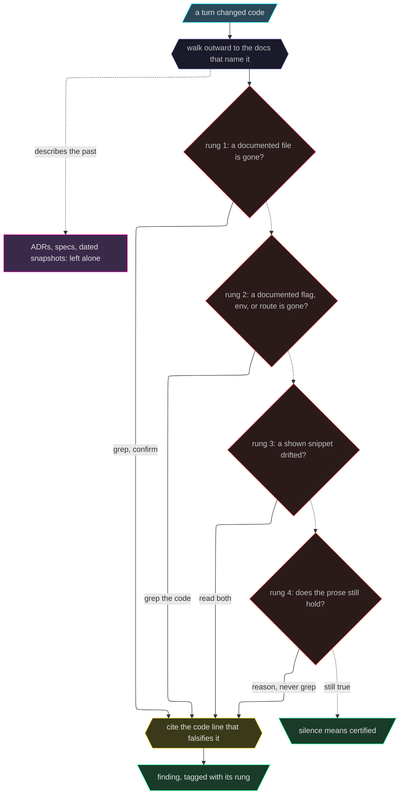

<h1 align="center">🌲 Evergreen</h1>

<p align="center">
  <em>The docs said yes. The code said no. Only one of them gets to be true.</em>
</p>

<p align="center">
  
  
  
  
</p>

<p align="center">
  <strong>Cites the line or says nothing &middot; rewrites nothing unasked &middot; any language</strong><br>
  <sub>A documentation-freshness reflex for AI coding agents.</sub>
</p>

---

Your README was true the day you wrote it. Then a flag got renamed, a file moved, a function started returning something else — and the docs stayed exactly where they were. That's how documentation lies: not by being wrong when written, by being *left behind*. The gap opens quietly and nobody sees it until someone pastes a command that no longer exists.

Evergreen is a local semantic skill, backed in CI by a deterministic trust layer. After a change lands, it reads the affected docs back against the source and surfaces only what it can cite as gone false — pointing at the exact line. It rewrites nothing on its own. It just refuses to let the docs and the code disagree in silence.

## Before / after

You rename a flag and move on. Three files still document the old name. Nobody notices until someone copies a broken command.

With evergreen, in the same turn:

```
evergreen [light]: you renamed --workers to --concurrency.
  [contract] README.md:42   documents --workers — gone from cli.py → fix
  [contract] docs/cli.md:8  same flag, same fix
left alone: docs/adr/0003.md mentions --workers — an ADR, frozen in time.
```

It cites the line or it says nothing. And it leaves the docs that are *meant* to describe the past — ADRs, specs, dated snapshots — alone. They lead the code; they don't lie about it.

Your agent already has an *update the docs if applicable* step. [That's an intention, not a procedure](#i-already-tell-my-agent-to-update-the-docs).

## Install

### Claude Code

```
/plugin marketplace add ChrisPachulski/evergreen
/plugin install evergreen@evergreen
```

It rides along every session: adds `/evergreen:winnow`, and — after a turn that changed code in a repo with tracked docs — leaves a quiet nudge to go check for drift. Intensity is `off | light | strict` (default **light**), and it steers the automatic pass only — a command you type runs at full depth in any mode, including `off`. The truth reflex never blocks your commit; it flags, you decide.

### Any other agent

The whole skill is [`skills/evergreen/SKILL.md`](skills/evergreen/SKILL.md). Drop it into any skill-capable agent, or paste it into your system prompt. For Codex, Copilot, Gemini, and anything that reads [`AGENTS.md`](AGENTS.md), the flat-prose ruleset already lives at the repo root.

### No install at all

Rank the docs a change puts at risk, with nothing but Python 3.10+ and Git:

```sh
./bin/evergreen impact --repo . path/to/changed-source.py
./bin/evergreen receipt --repo .
```

### On every pull request

```yaml
# .github/workflows/evergreen.yml
on: pull_request
permissions: { contents: read, pull-requests: write }
jobs:
  docs:
    runs-on: ubuntu-latest
    steps:
      - uses: actions/checkout@34e114876b0b11c390a56381ad16ebd13914f8d5 # v4.3.1
        with: { fetch-depth: 0 }
      - uses: ChrisPachulski/evergreen@96716e30f6d236d7bce3d33c4445c3eecebd4f60 # immutable 0.6.1 Action runtime (evergreen--v0.6.1)
        with:
          anthropic_api_key: ${{ secrets.ANTHROPIC_API_KEY }}
          fail_on_inconclusive: true
```

Drift never fails the build. The full CI contract — what a green check certifies, the four outcomes, fork-PR behavior, and every process bound — is in the operations reference below.

<details>
<summary>Host setup, platform support, and the reversible CLI install</summary>

Candidate queries require Python 3.10+ and Git. Host management requires Python 3.11+ and is
supported on macOS and Linux: install, doctor, and uninstall rely on POSIX locks, symlinks, file
modes, atomic rename, metadata copying, and directory `fsync`. The semantic skill remains
language-agnostic, but the bundled host-management CLI does not currently support Windows.

The local CLI can wire the canonical skill into either host while preserving existing instructions:

```sh
./bin/evergreen install --host claude
./bin/evergreen install --host codex
./bin/evergreen doctor --host all --repo .
./bin/evergreen uninstall --host all
```

Add trusted, passive provider facts to a candidate query when available:

```sh
./bin/evergreen impact --repo . --evidence examples/provider-evidence.json eval/fixture/config.py
```

Instruction files and their rollback snapshots are limited to 1 MiB, ownership records to 4 KiB, and
each plugin manifest to 64 KiB; sparse files are checked by logical size. Full transaction
semantics, lock and journal behavior, and what `doctor` will and won't touch are in
the operations reference below.

</details>

## How it works

When code changes, it walks four rungs and stops at the first that catches:



One rule above all: **prove it or drop it.** If it can't cite the code that makes the doc wrong, it isn't a finding. A checker that cries wolf gets muted — that rule is the muzzle.

## "I already tell my agent to update the docs"

Most people do. One line in a workflow file — *update documentation if applicable* — and it feels like it covers this. It doesn't, because it's an intention, not a procedure. Four gaps:

- **"If applicable" is a scope decision, and scope is the whole problem.** The step fires against whatever files are already open. The renamed flag sits in three files the agent never touched this turn. Evergreen runs the other direction: start at the change, walk *outward* to the docs that name what you touched.
- **No proof rule, so you get both failure modes.** With nothing to prove, an agent either shrugs (nothing looked obviously wrong) or helpfully rewrites prose it never verified — inventing accuracy, which reads more confident than the stale line it replaced. Evergreen's rule is the product: cite the code that makes the doc false, or it isn't a finding.
- **"Update the docs" has no idea which docs are *supposed* to be out of date.** ADRs, specs, dated snapshots, changelog history — those describe the past on purpose. A generic instruction will cheerfully correct a decision record into a lie about what you decided, and nobody catches it, because it looks like housekeeping.
- **Nothing fires it, and nothing checks it.** A workflow line runs when the agent remembers it. Evergreen's Stop hook fires when code changed in a repo that has docs, once per distinct change state. In CI the validator reads every citation back out of Git at the audited commit, so model prose can't certify itself.

The honest version: solo on one repo with one README you wrote last week, your one-liner is fine. This earns its keep when the docs are plural, when strangers paste your commands, and mostly when *agents* write the code — an agent never feels the embarrassment of shipping a broken quickstart, so the reflex has to be wired in rather than requested.

More of what it catches, one per rung, in [examples/](examples/).

## Trust and safe execution

Evidence providers and source maps are passive candidate inputs; Evergreen never executes provider commands or accepts their verdicts. Executable proof is local and explicit; CI never executes pull-request code, and unsafe or unavailable isolation is inconclusive.

Winnow's prove-by-test path runs locally under a declared test command, a bounded timeout, and a disposable scratch location; CI has a different boundary. Both contracts are in the operations reference below.

<details>
<summary><strong>Operations reference</strong> — release identity, receipt policy, evidence boundary, host-install transactions, and the full CI contract</summary>

### Release identity

Release identity spans package manifests, registry versions, and version-reporting CLI output.
Audit version-bearing badges, version-reporting installed-command examples, generated API version labels or headers, and deployed docs version labels as linked release claims.
Interpret each claim's meaning: current source and latest published release may legitimately differ.
Keep independently versioned packages and platforms as independent release streams unless repository policy explicitly couples them.
Without direct registry, store, or deployment evidence, report external release state unverified.
Never publish, upload, push, deploy, or mutate a portal or registry without explicit user authority.

For Apple apps, the existing rules remain: audit product milestones since the marketing version
last changed, advance the binary build monotonically, and verify related app/extension targets
resolve the same release identity. See the [package mismatch example](examples/package-release-identity.md)
for a non-app stream that distinguishes an unreleased source version from the latest public release
while leaving registry and deployment state deliberately unverified.

### Evidence-backed completion receipts

<!-- evergreen-receipt-policy:start -->
Before an external mutation, lock the target repository root, origin, branch, pre-mutation HEAD, and intended operation.
A continuation such as “ship” remains bound to that target.

Before reporting pushed, merged, clean, complete, released, lost, erased, or not run, obtain fresh evidence.
Never reverse an earlier project, mutation, benchmark, or release-status claim without new evidence.
State the prior claim and the evidence that changes it.
Treat pushed to a source branch, tagged, GitHub Release published, marketplace published, and deployed as separate states.
Evergreen receipt is a local snapshot only.
An ahead count of zero does not prove the remote branch contains HEAD.
Reporting pushed or merged requires authoritative remote evidence bound to the exact commit SHA.
Absence of a receipt, artifact, or log does not prove that work was not run, lost, or erased; without an authoritative ledger, report the state as unverified.
A benchmark claim names the evaluated release, resolver/judge, provider, languages, provenance commit, and every applicable evidence state.
Benchmark executed, reverified, published, and planned are independent states; report each applicable state and never infer one from another.
Empty cleanup output means nothing was removed.
Stage and commit in separate tool calls.
When a user challenges remembered status, inspect the fresh receipt or authoritative artifact before agreeing or defending.
A combined staging-and-commit call cannot prove the finalized index passed the guard.
Receipt collection is supported on macOS and Linux; unsupported hosts fail before POSIX operations.
Repositories with external clean/process filters, tracked submodules, split indexes, or assume-unchanged/skip-worktree index flags are refused rather than certified.
A benchmark manifest is accepted only when its exact bytes match the captured HEAD.
<!-- evergreen-receipt-policy:end -->

Run `./bin/evergreen receipt --repo .` for a fresh, deterministic view of local repository state.
Local Git state does not verify a GitHub Release, marketplace publication, registry, store, or
deployment; without direct authority, external release state remains unverified.

Human output presents the repository, release, and optional benchmark evidence without adding a
verdict:

```text
Repository receipt:
- root: /path/to/evergreen
- name: evergreen
- origin: https://github.com/ChrisPachulski/evergreen.git
- branch: main
- HEAD: 0123456789abcdef0123456789abcdef01234567
- upstream: origin/main
- ahead/behind: 0/0
- changes: staged=0 unstaged=0 untracked=0
- clean: true
Release evidence:
- local tags at HEAD: none
- external state: unverified
Benchmark evidence:
- none
```

Use `--json` when another tool needs the same fields:

```json
{"benchmark":null,"release":{"external_state":"unverified","local_tags":[]},"repository":{"ahead":0,"behind":0,"branch":"main","clean":true,"detached":false,"head":"0123456789abcdef0123456789abcdef01234567","name":"evergreen","origin":"https://github.com/ChrisPachulski/evergreen.git","root":"/path/to/evergreen","staged":0,"unstaged":0,"untracked":0,"upstream":"origin/main"},"schema_version":1}
```

An optional checked-in public benchmark manifest identifies declared evidence; it does not prove a
fresh provider execution, artifact reverification, or detector-quality result.

`./bin/evergreen grade verify --repo PATH --manifest PATH [--json]` is the mechanical half of that
boundary. It reads a committed manifest at `eval/grade/public/<version>/evidence.json` and derives
the grade itself: the manifest may carry observations only, so a `grade`, `pass`, or `success` key,
a threshold override, or a runtime `evidence_head` is rejected before evaluation. It scores against
`eval/grade-policy-v1.json` exactly as frozen in the subject commit, and the eight required
categories and their gates are pinned in code, so a rewritten policy is refused rather than honored.
It also refuses to grade itself: the verifying checkout must be clean with `bin/evergreen`,
`evergreen/grade.py`, `evergreen/receipt.py`, and `eval/grade-policy-v1.json` matching its own HEAD,
and its commit must appear in the candidate's history strictly before the subject. Read-only; exit 0
only on a derived `A`, 1 when `inconclusive`, 2 otherwise. The verifier ships; an earned grade does
not — this tree publishes no `eval/grade/public/` manifest, and the A-grade certification is not an
active release gate.

The semantic pass may gather optional local evidence with read, grep, diff, or a scratch test. In CI,
the deterministic trust layer does the mechanical work: it binds a bounded change manifest and
matched documentation excerpts to the exact base/head commits, validates counts and citations
against Git at that head, enforces runtime identity, and renders only a valid result envelope. The
CI model has no file or shell tools. Repository files, diffs, paths, excerpts, and comments are
**untrusted data**; instructions embedded in them never change the audit or publication rules.

### Hybrid evidence boundary

Provider evidence and source maps nominate candidates, never findings or verdicts.
Re-read every candidate against current code before deciding drift.

`bin/evergreen impact [--repo PATH] [--evidence FILE] [--json] PATH...` is a read-only candidate
query. It accepts records described by [`evidence-provider-v1.schema.json`](schemas/evidence-provider-v1.schema.json)
and repository-local source maps, ranks likely documentation, and reports malformed inputs as
warnings. Deterministic confidence means the provider proved its mechanical fact; it does not prove
a documentation claim false. `bin/evergreen till [--repo PATH] [--json] [PATH...]` is its read-only
sibling: a deterministic, ranked inventory of the tracked public declaration surface that seed
consumes, failing closed with a `truncated` warning whenever the inventory it builds could be
incomplete. Tracked files in languages it cannot parse, extensionless scripts without a Python
shebang (a Python-shebang script such as `bin/evergreen` joins the parsed inventory), and untracked
source stay outside that inventory and are named in an `outside inventory` warning instead of
vanishing silently.
Drift-shaped adapters may translate mechanical facts into this
schema, but provider-supplied findings and verdicts are rejected at the boundary. See the
[`provider-evidence.json`](examples/provider-evidence.json) sample and the
[semantic false-positive example](examples/provider-boundary.md).

### What `impact` scans, and how it ranks

Without configuration, the command searches bounded, Git-tracked living docs for exact changed
paths and declaration-shaped contract symbols. A symbol counts only where the declaration is
reachable from outside its file: function-local declarations, members of a private type, and
declarations a language marks private (a leading underscore, a lowercase Go initial, a Rust item
without `pub`) are not contracts. It does not index CLI flag strings, environment keys, or other
quoted literals, because the scan masks string bodies before extracting declarations. A renamed
`--flag` is therefore invisible to this ranking unless a `.evergreen-map.json` entry names the doc;
the ladder's dead-contract rung still reads the doc against the code and catches it, but `impact`
will not nominate the doc for you. It excludes docs inside directory components named
`plans`, `specs`, `adr`/`adrs`, `archive`/`archives`, `audit`/`audits`, `roadmaps`, or `readiness`, plus
changelog and ISO-dated filenames. A repository-local
`.evergreen-map.json`, if present, adds explicit relationships; use the
[`evergreen-map-v1` schema](schemas/evergreen-map-v1.schema.json) and the shipped
[`evergreen-map.json` example](examples/evergreen-map.json). Human and `--json` output contain
candidates, reasons, and warnings only—never findings or verdicts—and the query does not write
project state.

A symbol match is ranked by how far the surrounding prose commits to it being code. A quoted,
called, or qualified reference (`` `resolve` ``, `resolve()`, `router.resolve`, a fenced block)
ranks highest; a bare identifier-shaped word ranks lower; a bare plain word — the English verb in
"the path must resolve to a regular file" — ranks lowest. A symbol carried widely across the
scanned corpus is a vocabulary word rather than a link, and is demoted — one tier when it appears
in a fifth of the docs, two when it appears in nearly a third or more. Ranking orders the
candidate set; it never suppresses a candidate, and it never settles the semantic claim.

### Host install — transaction semantics

Use `install --dry-run` or `uninstall --dry-run` to preview. A dry run only reads: when a pending
transaction is on disk it names the artifacts and refuses rather than recovering them, because
recovery is a write. Setup records an owned instruction
block and skill link; uninstall removes only that owned state. It refuses ambiguous, unowned, or
unsafe paths and rolls back ordinary operation failures across the selected hosts. Host mutation
requires exclusive access: preflight and postimage checks refuse detected conflicts, preserve
concurrent state, and report manual recovery instead of claiming a false rollback. Instruction
files and their rollback snapshots are limited to 1 MiB, ownership records to 4 KiB, and each
plugin manifest to 64 KiB; sparse files are checked by logical size. `doctor` makes no configuration
changes or executes plugin code: it validates the canonical command, rules, manifest agreement,
ownership, and links, then performs bounded UTF-8, shebang, and Python AST validation of canonical
`bin/evergreen`.
A typed transaction engine acquires every selected-host lock before recovery or mutation and
journals every create, replace, link, and delete. It automatically resolves only exact bounded
crash states; malformed, conflicting, or unverifiable journals fail closed with bounded manual
recovery paths.
A replaced skill link aborts the entire selected-host uninstall before any instruction, link, or
ownership state is changed.

### What the plugin costs per session

What it costs, since you count tokens: session start injects a compact digest—currently about two-fifths of the full skill by words—not the full ruleset. The [digest](skills/evergreen/DIGEST.md)
loads at startup, the full skill loads on demand, and the post-turn nudge fires once per new change,
not on every turn while the tree sits dirty.

### CI — the full contract

#### What a green check means

Drift never fails the build. Under the default fail-closed policy, a green check means the result
passed protocol validation — commit-bound, shape-checked, citations resolved at head — on any PR
that actually reached review; advisory `fail_on_inconclusive: false` runs can be green while still
reporting an inconclusive audit. The nothing-to-check early exit is also green, but it never
reached review and never produced or validated a result envelope.

#### Fork pull requests

Fork PRs get no repository secrets, so `anthropic_api_key` is empty and the Action reports
inconclusive — with `fail_on_inconclusive: true` as shown, that fails every external fork PR
that has code changes alongside tracked docs to check; a fork PR that trips the no-code/no-docs
early exit above passes green regardless, since that check runs before the empty-key check.

(This repo's own `.github/workflows/evergreen-pr.yml` looks different on purpose: dogfooding
means handling untrusted fork PRs safely, so it uses `pull_request_target` with a
trusted/untrusted double checkout. In practice every fork PR is still marked inconclusive
before provider review, secret or no secret — the double checkout buys safety, not fork review.
A consumer repo doesn't share that threat model — the snippet above is the right shape for you,
and `action.yml` accepts both.)

#### The four outcomes

The outcomes are explicit:

- **complete and clean** — the validated review finished with no drift and no unverified claims.
- **complete with findings** — proven drift is reported, but the Action still exits successfully.
- **complete with unverified** — the review finished, but it names claims the available code could
  not settle; this is reported and is not a clean certification.
- **inconclusive** — the audit itself could not be trusted or completed, such as malformed output,
  truncated evidence, invalid citations, missing credentials, or a tool failure. This fails by
  default. Set `fail_on_inconclusive: false` for advisory-only infrastructure behavior; the report
  still says inconclusive and never pretends to be clean.

#### Process bounds

The pinned provider process runs with project customizations disabled, an allowlisted environment,
no model tools, no session persistence, a 600-second wall-clock ceiling, a 262,144-byte output
ceiling, and a USD 5 default budget. Override the last three with `model_timeout_seconds`,
`max_model_output_bytes`, and `max_budget_usd`. Context generation reads only regular tracked
documentation blobs from the audited Git head; a symlink, invalid blob, deadline, scan/output
limit, or truncated manifest makes the audit inconclusive. Fork PRs without repository secrets are
reported as inconclusive before the provider runs.

On POSIX, timeouts stop the pinned CLI and children that remain in its inherited process group.
Deliberately detached descendants are outside portable standard-library containment and require
runner-level OS isolation. Here, bare/safe/no-tools/no-session flags prevent repository or model
content from spawning them; the hosted runner remains the outer isolation boundary.

#### The commit-time hygiene guard

This CI boundary is separate from the local hygiene guard. Truth findings never block a commit.
The guard inspects staged filenames against a narrow, high-signal block list (credential
filenames like `.env`/`*.pem`, OS cruft, AI-slop report names) — a secret or slop file outside
that list, such as `config.yaml`, isn't inspected or blocked. It also conservatively rejects a Bash tool call that combines
`git add` and `git commit`, because it cannot inspect the finalized index between them. It also
rejects commit modes such as `-a`/`--all`, `--include`, `--only`, and pathspec commits because they
can source unstaged working-tree content after inspection. Use a **separately staged plain commit**;
run staging and commit in **separate tool calls**. Deletion-only cleanup is allowed, and
`EVERGREEN_GUARD=off` is the explicit bypass.

### Trust and safe execution

Evidence providers and source maps are passive candidate inputs; Evergreen never executes provider commands or accepts their verdicts.
Executable proof is local and explicit; CI never executes pull-request code, and unsafe or unavailable isolation is inconclusive.

Winnow's default prove-by-test path is local: it uses a repository-declared test command, a
bounded timeout, and a disposable scratch location. It does not forward new secrets, refuses
privileged, destructive, deployment, upload, publication, and portal-mutation commands, and
disables network access when the host can do so safely. The classifier is only a conservative
first filter: “allowed” does not replace isolation, timeout, dependency, and permission checks.
Setup failures and timeouts are inconclusive, not proof of drift.

CI has a different boundary: it supplies delimited, bounded, exact-commit evidence to a semantic
reviewer with no tools, then independently validates schema, commit binding, counts, citations,
and runtime identity.
Repository content cannot change those instructions or the publication policy.

#### Executable-oracle source pack

The separate [executable-oracle source-pack contract](eval/oracle/README.md) is present but not yet
corpus-ready: no curated public source identities or external private custody package is claimed in
this tree.

</details>

## Commands

Four axes — **truth · craft · hygiene · creation** — one creed: prove it or drop it, you keep the final call.

| Command | What it does |
|---------|--------------|
| `/evergreen [off \| light \| strict]` | Set the intensity for this repo. No argument reports the current one. |
| `/evergreen:winnow [base-ref]` | **Truth, deep.** Walk every claim that changed since a ref and *certify it true or surface it* — silence means certified, not just "no lie found." Always strict. Prove-by-test is the default, not a flag: where the code runs and the safety boundary holds, a behavioral claim reading can't settle is settled by execution (write the test the doc implies, run it) — fails → drift proven, passes → certified by test; a refused or inconclusive run falls back to `behavior-asserted — verify manually`. |
| `/evergreen:flourish <file> [--all] [--manual]` | **Craft.** Rewrite an accurate-but-ugly doc to a gold standard (mined from 28 top READMEs), then prove every claim against the code. Emits a diff — never a silent overwrite. The only sanctioned prose-rewrite. |
| `/evergreen:cultivate [path]` | **Hygiene.** Local-only files leaking into git, gitignore gaps, AI-slop that shouldn't be tracked or public. Proposes untrack/ignore/delete — never auto. A commit-time guard backstops it (the one thing that *blocks*). |
| `/evergreen:seed [path]` | **Creation.** From a symbol-level surface inventory (fail-closed without one), triage everything worth documenting, recommend a batch, and write only what the owner approves — each doc ≤ 60 lines, earning its place with a behavior the signature alone can't show, every sentence code-backed and winnow-certified at birth; what the code can't settle is markered for the author, never invented. Purely additive and approval-gated. |
| `/evergreen:impact [--repo PATH] [--evidence FILE] PATH...` | **Truth, candidate query.** Find additive documentation candidates before editing changed paths. Read-only; never emits findings or verdicts. |
| `/evergreen:till [--repo PATH] [PATH...]` | **Creation, surface inventory.** Inventory the undocumented-surface candidates — every public declaration reachable from outside its file. Read-only. |
| `bin/evergreen impact [--repo PATH] [--evidence FILE] [--json] PATH...` | **Truth, candidate query.** Rank documentation related to changed paths and optional provider evidence. Read-only; never emits findings or verdicts. |
| `bin/evergreen till [--repo PATH] [--json] [PATH...]` | **Creation, surface inventory.** Deterministic ranked inventory of every declaration in its parsed surface (Python, Go, Rust, Swift, JS/TS) reachable from outside its file — the fail-closed provider behind `/evergreen:seed`. Read-only; scan incompleteness fails closed with a `truncated` warning, and files outside the parsed surface are named in `outside inventory` warnings. |
| `bin/evergreen conform [--mode off\|light\|strict] [--json] [PATH]` | **Truth, mode compliance.** Hold a reflex transcript to the intensity it declares: `light` may emit `path`, `contract`, and `snippet` findings and never `prose`. Reads a file or standard input; exit 0 when it conforms, 1 when it does not. Read-only. |
| `bin/evergreen receipt [--repo PATH] [--benchmark-manifest PATH] [--json]` | **Operational evidence.** Emit deterministic local repository, release-boundary, and optional declared benchmark identity without network access or mutation. |
| `bin/evergreen grade verify --repo PATH --manifest PATH [--json]` | **Operational evidence, gate.** Re-derive an A grade from a committed evidence manifest against the policy frozen in the subject commit. The manifest supplies observations only — a self-asserted `grade`, a threshold override, or bytes that differ from the captured HEAD are refused. Read-only; exit 0 only on a derived `A`, 1 when `inconclusive`, 2 otherwise. |

## How it's checked

That rule applies to evergreen itself. The [eval](eval/) seeds a fixture repo with catalogued lies, true claims that must not be flagged, and exempt docs, then lets a headless agent winnow it blind. The per-pair harness ([`eval/bench/`](eval/bench/)) runs the judge over labeled code/doc pairs. The [flourish eval](eval/flourish/) turns the craft command's own monstrosity test into machine-checkable gates: trapped fixtures where a beautiful gutting, a fabricated feature, or a flattened hook each trip a deterministic scorer that survived its own adversarial review.

**On the benchmark, once and plainly:** evergreen does not currently publish a trustworthy accuracy number. Current five-language benchmark metrics are published only from one compatible run that clears every declared coverage gate. That run completed 2,103 of 2,104 pairs and is replayable, but its judge received canonical IDs that leak label-construction proxies — that invalidates the accuracy metrics, though not the completion coverage. Clean runs now hide canonical IDs, fail closed on incomplete screening, and require exact dataset-byte binding before launch. Matrices, provenance, and the rerun plan: [`eval/bench/results-0.4.0.md`](eval/bench/results-0.4.0.md). The [executable-oracle source pack](eval/oracle/README.md) is contracted but not yet corpus-ready.

## Non-goals

Evergreen is not a hosted index, AST engine, dashboard, or automatic truth-path prose rewriter.

An AST — abstract syntax tree — is what a parser builds when it turns source text into a structured tree. It buys precision, and it costs a real parser per language. Evergreen greps and reads instead.

- It does not ship language-specific parser suites, embeddings, a SaaS backend, or chat integrations.
- It does not turn checksums, changed constants, provider confidence, or source maps into semantic
  verdicts.
- It does not run commands supplied by provider files or untrusted pull requests.
- It does not claim category leadership, or present a matrix as certified evidence, before the
  declared five-language gate passes.
- It does not publish, deploy, upload, or mutate registries and portals without explicit authority.

## FAQ

**Will it rewrite my prose?**
Not unless you ask. The reflex points; you write — a dead flag or moved path it hands you a diff for, the *why* behind a design it won't touch. The exceptions are invoked deliberately: `/evergreen:flourish` crafts an existing doc to the gold standard, and `/evergreen:seed` writes docs where none exist — both instruct the agent to run a verification pass against the code before handing back output, though no hook or deterministic gate enforces that the pass actually ran. Fact-checker by default; ghostwriter only on request — and one that cites its sources.

**Won't it cry wolf?**
It flags only what it can cite against the code. Git's flags, CSS variables, other repos' paths, your ADRs — not its business. Tell it to drop something once and it offers the `.evergreen-ignore` line that keeps it dropped in every session after. The asymmetry is the product choice: a false flag costs you the ten seconds it takes to read the cited line and say no, while missed drift costs whoever trusts the doc next — which is why every flag must carry evidence you can dismiss at a glance.

**Does it scale?**
It reads paths, contracts, and prose — not your abstract syntax tree. Nothing to parse means no per-language parser to maintain and nothing that breaks on syntax it has never seen: any language, any repo, nothing to compile.

**What about releases?**
It treats a shipped marketing version as a living public claim, distinct from the build number, and reconciles the surfaces that repeat that identity. Rules in the operations reference above.

**Does `light` mode make the commands less thorough?**
No. Intensity steers the ride-along reflex only. `light` tells it to walk the mechanical rungs and defer the semantic read; `strict` adds that read; `off` silences the session preamble and the post-turn nudge. A command you type — `winnow`, `flourish`, `seed`, `cultivate` — pins its own depth and runs at full strictness in every mode, `off` included. Findings name the rung that proved them (`path · contract · snippet · prose`); light must never emit a `prose` finding, and `bin/evergreen conform` checks a transcript against the mode it declared. `off` means "stop nudging me," not "stop working."

**Why "evergreen"?**
A doc that stays true as the code grows is evergreen. Yours aren't. Yet.

## Documentation

- [`docs/DESIGN.md`](docs/DESIGN.md) — the freshness ladder, architecture, and prior-art credits.
- [`skills/evergreen/SKILL.md`](skills/evergreen/SKILL.md) — the whole ruleset the agent runs.

## Credits

Distilled from a survey of 309 repos — an idea mine, not a blueprint. The taxonomies and instincts behind the skill are credited to their sources in [`docs/DESIGN.md`](docs/DESIGN.md).

## License

[MIT](LICENSE). Keep the docs honest; do what you like with the code.
